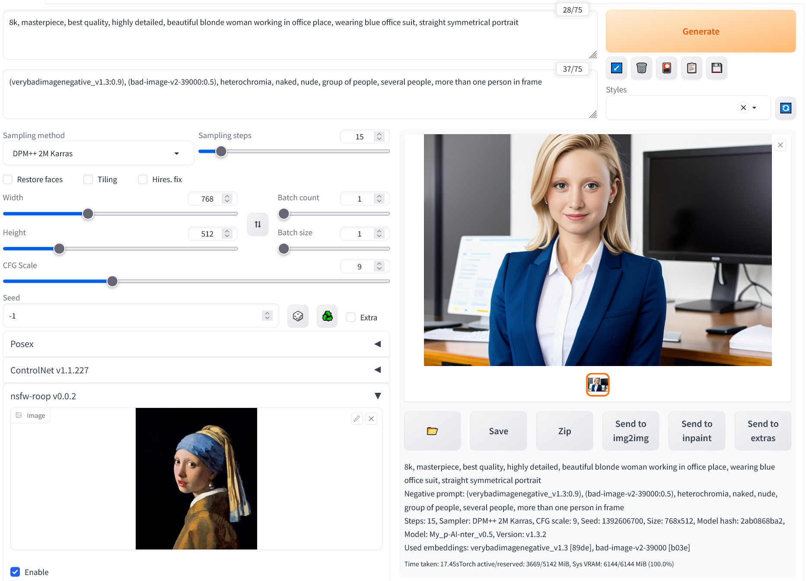

  
    
  

  
  
  
  
  

  [English](/README.md) | Русский

# ReActor для StableDiffusion
### Расширение для быстрой и простой замены лиц на любых изображениях. Без фильтра цензуры, 18+, используйте под вашу собственную [ответственность](#disclaimer)

---

  <b>
    <a href="#installation">Установка</a> | <a href="#usage">Использование</a> | <a href="#api">API</a> | <a href="#troubleshooting">Устранение проблем</a> | <a href="#updating">Обновление</a> | <a href="#comfyui">ComfyUI</a> | <a href="#disclaimer">Ответственность</a>
  </b>

---

<table>
  <tr>
    <td width="144px">
      <a href="https://boosty.to/artgourieff" target="_blank">
        
         
        
          Поддержать проект
        
      </a>
    </td>
    <td>
      ReActor это расширение для Stable Diffusion WebUI, которое позволяет делать простую и точную замену лиц на изображениях. Сделано на основе <a href="https://github.com/Gourieff/ReActor-UI" target="_blank">ReActor-UI</a>.
    </td>
  </tr>
</table>

<a name="installation">

## Установка

[Automatic1111](#a1111) | [Vladmandic SD.Next](#sdnext) | [Google Colab SD WebUI](#colab)

<a name="a1111">Если вы используете [AUTOMATIC1111 Web-UI](https://github.com/AUTOMATIC1111/stable-diffusion-webui/):

1. (Для пользователей Windows):
  - Установите **Visual Studio 2022** (Например, версию Community - этот шаг нужен для правильной компиляции библиотеки Insightface):
  https://visualstudio.microsoft.com/downloads/
  - ИЛИ только **VS C++ Build Tools** (если вам не нужен весь пакет Visual Studio), выберите "Desktop Development with C++" в разделе "Workloads -> Desktop & Mobile":
  https://visualstudio.microsoft.com/visual-cpp-build-tools/
  - ИЛИ если же вы не хотите устанавливать что-либо из вышеуказанного - выполните [следующие шаги (пункт VIII)](#insightfacebuild)
2. Внутри SD Web-UI перейдите во вкладку "Extensions" и вставьте ссылку `https://github.com/Gourieff/sd-webui-reactor` в "Install from URL" и нажмите "Install"
3. Пожалуйста, подождите несколько минут, пока процесс установки полностью не завершится
4. Проверьте последнее сообщение в консоли SD-WebUI:
* Если вы видите "--- PLEASE, RESTART the Server! ---" - остановите Сервер (CTRL+C или CMD+C) и запустите его заново - ИЛИ же перейдите во вкладку "Installed" (*если у вас имееются какие-либо другие расширение, основанные на Roop или клонах ReActor - отключите их, иначе данное расширение может не работать*), нажмите "Apply and restart UI" 
* Если вы видите "Done!", перейдите во вкладку "Installed" (*если у вас имееются какие-либо другие расширение, основанные на Roop или клонах ReActor - отключите их, иначе данное расширение может не работать*), нажмите "Apply and restart UI" - или же просто перезагрузите UI, нажав на "Reload UI"
5. Готово!

<a name="sdnext">Если вы используете [SD.Next](https://github.com/vladmandic/automatic):

1. Закройте (остановите) SD WebUI Сервер, если он запущен
2. (Для пользователей Windows) Смотрите [Шаг 1](#a1111) для Automatic1111 (если же вы следовали [данным шагам (пункт VIII)](#insightfacebuild) вместо этого - переходите к Шагу 5)
3. Перейдите в (Windows)`automatic\venv\Scripts` или (MacOS/Linux)`automatic/venv/bin`, запустите Терминал или Консоль (cmd) для данной папки и выполните `activate`
4. Выполните `pip install insightface==0.7.3`
5. Запустите SD.Next, перейдите во вкладку "Extensions", вставьте эту ссылку `https://github.com/Gourieff/sd-webui-reactor` в "Install from URL" и нажмите "Install"
6. Пожалуйста, подождите несколько минут, пока процесс установки полностью не завершится
7. Проверьте последнее сообщение в консоли SD.Next:
* Если вы видите "--- PLEASE, RESTART the Server! ---" - остановите Сервер (CTRL+C или CMD+C) и запустите его заново - ИЛИ же перейдите во вкладку "Installed" (*если у вас имееются какие-либо другие расширение, основанные на Roop или клонах ReActor - отключите их, иначе данное расширение может не работать*), нажмите "Restart the UI"
8. Остановите Сервер SD.Next, перейдите в директорию `automatic\extensions\sd-webui-reactor` - если вы видите там папку `models\insightface` с файлом `inswapper_128.onnx` внутри, переместите его в папку `automatic\models\insightface`
9. Готово, можете запустить SD.Next WebUI!

<a name="colab">Если вы используете [Cagliostro Colab UI](https://github.com/Linaqruf/sd-notebook-collection):

1. В активном WebUI, перейдите во вкладку "Extensions", вставьте ссылку `https://github.com/Gourieff/sd-webui-reactor` в "Install from URL" и нажмите "Install"
2. Пожалуйста, подождите некоторое время, пока процесс установки полностью не завершится
3. Когда вы увидите сообщение "--- PLEASE, RESTART the Server! ---" (в секции "Start UI" вашего ноутбука "Start Cagliostro Colab UI") - перейдите во вкладку "Installed" и нажмите "Apply and restart UI" (*если у вас имееются какие-либо другие расширение, основанные на Roop или клонах ReActor - отключите их, иначе данное расширение может не работать*)
4. Готово!

<a name="usage">

## Использование

> Используя данное программное обеспечение, вы соглашаетесь с [ответственностью](#disclaimer)

1. В раскрывающимся меню "ReActor" импортируйте изображение, содержащее лицо;
2. Установите флажок "Enable";
3. Готово, теперь результат будет иметь то лицо, которое вы выбрали.

### Если лицо получилось нечётким
Используйте опцию "Restore Face". Также можете попробовать опцию "Upscaler". Для более точного контроля параметров используйте Upscaler во вкладке "Extras".
Также вы можете установить порядок постобработки (начиная с версии 0.1.0):

*Прежняя логика была противоположенной (Upscale -> затем Restore), что приводило к более худшему качеству изображения лица (а также к значительной разнице текстур) после увеличения.* 

### Результат имеет несколько лиц
Выберите номера лиц, которые нужно поменять, используя поля "Comma separated face number(s)" для исходного изображения лица и для результата. Можно устанавливать любой, необходимый вам, порядок лиц.

### ~~Результат получился чёрным~~
~~Это значит, что сработал NSFW фильтр.~~

### Img2Img

Используйте эту вкладку, чтобы заменить лицо на уже готовом изображении (флажок "Swap in source image") или на сгенерированном на основе готового (флажок "Swap in generated image").

Inpainting также работает, но замена лица происходит только в области маски. Пожалуйста, используйте с опцией "Only masked" для "Inpaint area", если вы применяете "Upscaler".

## API

Вы можете использовать ReActor как со встроенным SD Webui API так и через внешнее API.

Подробная инструкция **[здесь](/API.md)**.

<a name="troubleshooting">

## Устранение проблем

**I. "You should at least have one model in models directory"**

Проверьте путь, где хранится модель "inswapper_128.onnx". Файл должен находиться в папке `stable-diffusion-webui\models\insightface`. Переместите модель туда, если она находится в какой-то иной директории.

**II. Any problems with installing Insightface or other dependencies**

(Для пользователей Mac M1/M2) Если вы получаете ошибки в ходе установки Insightface - читайте https://github.com/Gourieff/sd-webui-reactor/issues/42

(Для пользователей Windows) Если VS C++ Build Tools или MS VS 2022 установлены но вы видите ошибки, связанные с отсутствием Insightface, попробуйте следующее:
1. Закройте (остановите) SD WebUI Сервер и запустите его снова (возможно, не прошла инициализация пакета после его установки)
   
(Для пользователей любых ОС) Попробуйте следующее:
1. Закройте (остановите) SD WebUI Сервер, если он запущен
2. Перейдите в папку (Windows)`venv\Lib\site-packages` или (MacOS/Linux)`venv/lib/python3.10/site-packages`
3. Если вы видите к-л папки с именами, начинающимися с `~` (например, "~rotobuf") - удалите их
4. Перейдите в (Windows)`venv\Scripts` или (MacOS/Linux)`venv/bin`
5. Откройте Терминал или Консоль (cmd) для этой папки и выполните `activate`
6. Для начала обновите pip: `pip install -U pip`
7. Далее:
   - `pip install insightface==0.7.3`
   - `pip install onnx==1.14.0`
   - `pip install onnxruntime==1.15.0`
   - `pip install opencv-python==4.7.0.72`
   - `pip install tqdm`
8. Выполните `deactivate`, закройте Терминал или Консоль и запустите SD WebUI, ReActor должен запуститься без к-л проблем - если же нет, добро пожаловать в раздел "Issues".

**III. "TypeError: UpscaleOptions.init() got an unexpected keyword argument 'do_restore_first'"**

Для начала отключите любые другие Roop-подобные расширения:
- Перейдите в 'Extensions -> Installed' и снимите флажок с ненужных:
  
- Нажмите 'Apply and restart UI'

Альтернативные решения: 
- https://github.com/Gourieff/sd-webui-reactor/issues/3#issuecomment-1615919243
- https://github.com/Gourieff/sd-webui-reactor/issues/39#issuecomment-1666559134 (актуально для Vladmandic SD.Next)

**IV. "AttributeError: 'FaceSwapScript' object has no attribute 'enable'"**

Отключите расширение "SD-CN-Animation" (или какое-либо другое, вызывающее конфликт)

**V. "INVALID_PROTOBUF : Load model from <...>\models\insightface\inswapper_128.onnx failed:Protobuf parsing failed"**

Эта ошибка появляется, если что-то не так с файлом модели `inswapper_128.onnx`.

Скачайте вручную по ссылке [here](https://github.com/facefusion/facefusion-assets/releases/download/models/inswapper_128.onnx)
и сохраните в директорию `stable-diffusion-webui\models\insightface`, заменив имеющийся файл.

**VI. "ValueError: This ORT build has ['TensorrtExecutionProvider', 'CUDAExecutionProvider', 'CPUExecutionProvider'] enabled"**

1. Закройте (остановите) SD WebUI Сервер, если он запущен
2. Перейдите в (Windows)`venv\Lib\site-packages` или (MacOS/Linux)`venv/lib/python3.10/site-packages` и посмотрите, если там папки с именам, начинающимися на "~" (например, "~rotobuf"), удалите их
3. Перейдите в (Windows)`venv\Scripts` или (MacOS/Linux)`venv/bin`, откройте Терминал или Консоль (cmd) и выполните `activate`
4. Затем:
- `python -m pip install -U pip`
- `pip uninstall -y onnx onnxruntime onnxruntime-gpu onnxruntime-silicon`
- `pip install onnx==1.14.0 onnxruntime==1.15.0`

Если это не помогло - значит какое-то другое расширение переустанавливает `onnxruntime` всякий раз, когда SD WebUI проверяет требования пакетов. Внимательно посмотрите список активных расширений. Если видите там "WD14 tagger" - попробуйте отключить его и ещё раз выполнить шаги выше. Это расширение вызывает переустановку `onnxruntime` на `onnxruntime-gpu` при каждом запуске SD WebUI.

**VII. "ImportError: cannot import name 'builder' from 'google.protobuf.internal'"**

1. Закройте (остановите) SD WebUI Сервер, если он запущен
2. Перейдите в (Windows)`venv\Lib\site-packages` или (MacOS/Linux)`venv/lib/python3.10/site-packages` и посмотрите, если там папки с именам, начинающимися на "~" (например, "~rotobuf"), удалите их
3. Перейдите в папку "google" (внутри "site-packages") и удалите любые папки с именам, начинающимися на "~"
4. Перейдите в (Windows)`venv\Scripts` или (MacOS/Linux)`venv/bin`, откройте Терминал или Консоль (cmd) и выполните `activate`
5. Затем:
- `python -m pip install -U pip`
- `pip uninstall protobuf`
- `pip install protobuf==3.20.3`

Если это не помгло - значит, есть к-л другое расширение, которое использует более новую версию пакета protobuf, и SD WebUI устанавливает эту версию при каждом запуске.

<a name="insightfacebuild">**VIII. (For Windows users) If you still cannot build Insightface for some reasons or just don't want to install Visual Studio or VS C++ Build Tools - do the following:**

1. Закройте (остановите) SD WebUI Сервер, если он запущен
2. Скачайте готовый [пакет Insightface](https://github.com/Gourieff/sd-webui-reactor/raw/main/example/insightface-0.7.3-cp310-cp310-win_amd64.whl) и сохраните его в корневую директорию stable-diffusion-webui (или SD.Next) - туда, где лежит файл "webui-user.bat"
3. Из корневой директории откройте Консоль (CMD) и выполните `.\venv\Scripts\activate`
4. Обновите PIP: `python -m pip install -U pip`
5. Затем установите Insightface: `pip install insightface-0.7.3-cp310-cp310-win_amd64.whl`
6. Готово!

**IX. 07-August Update problem**

Если после очередного `git pull` вы получили сообщение: `Merge made by the 'recursive' strategy` и затем, когда проверяете статус репозитория через `git status`, вы видите `Your branch is ahead of 'origin/main' by`

Выполните следующее:

Внутри папки `extensions\sd-webui-reactor` запустите Терминал или Консоль (cmd) и затем:
- `git reset f48bdf1 --hard`
- `git pull`

ИЛИ:

Полностью удалите папку `sd-webui-reactor` внутри директории `extensions`, запустите Терминал или Консоль (cmd) и выполните `git clone https://github.com/Gourieff/sd-webui-reactor`

<a name="updating">

## Обновление

Самый простой и удобный способ обновления SD WebUI и расширений: https://github.com/Gourieff/sd-webui-extensions-updater

## ComfyUI

Вы можете использовать ReActor с ComfyUI 
Инструкция здесь: [ReActor Node](https://github.com/Gourieff/comfyui-reactor-node)

<a name="disclaimer">

## Ответственность

Это программное обеспечение призвано стать продуктивным вкладом в быстрорастущую медиаиндустрию на основе генеративных сетей и искусственного интеллекта. Данное ПО поможет художникам в решении таких задач, как анимация собственного персонажа или использование персонажа в качестве модели для одежды и т.д.

Разработчики этого программного обеспечения осведомлены о возможных неэтичных применениях и обязуются принять против этого превентивные меры. Мы продолжим развивать этот проект в позитивном направлении, придерживаясь закона и этики.

Подразумевается, что пользователи этого программного обеспечения будут использовать его ответственно, соблюдая локальное законодательство. Если используется лицо реального человека, пользователь обязан получить согласие заинтересованного лица и четко указать, что это дипфейк при размещении контента в Интернете. **Разработчики и Со-авторы данного программного обеспечения не несут ответственности за действия конечных пользователей.**

Используя данное расширение, вы соглашаетесь не создавать материалы, которые:
- нарушают какие-либо действующие законы тех или иных государств или международных организаций;
- причиняют какой-либо вред человеку или лицам;
- пропагандируют любую информацию (как общедоступную, так и личную) или изображения (как общедоступные, так и личные), которые могут быть направлены на причинение вреда;
- используются для распространения дезинформации;
- нацелены на уязвимые группы людей.
